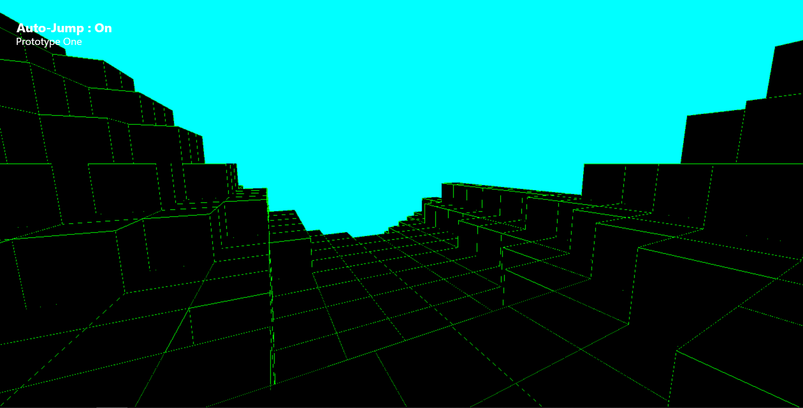

# Craftos: a Cyberpunk block world!
Implement model structures with obj dex.
A Vanilla JS Original

## Installation
Using [Visual Studio Code](https://code.visualstudio.com/) and the [Live Server](https://marketplace.visualstudio.com/items?itemName=ritwickdey.LiveServer) 
extension! 
  1. Open VSCode
  2. File > Open
  3. Find "Craftos" folder & import
  4. Find "index.html"
  5. Click "Start Server"
  6. Play now!

## Usage
Craftos is free, download the zip and start in seconds.
Friendly open source - 
be creative, have fun. 
